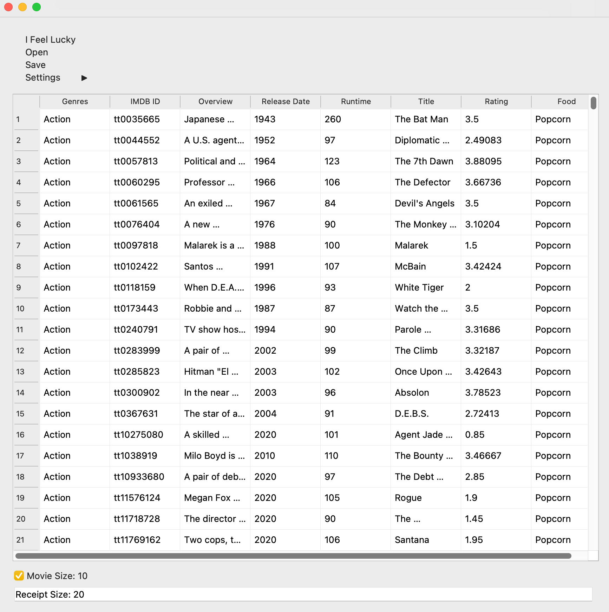

# Stage report:

### 17/Sep/2023
 - Version : A 0.9
 - structure: GUI interface using QT5 library. Data read in from csv and txt files in data folder 
 - current feature: able to view list of movies on GUI interface. User can click on the movie posters to view movie details. A separate button can be clicked to access the food pairing for the movie.

